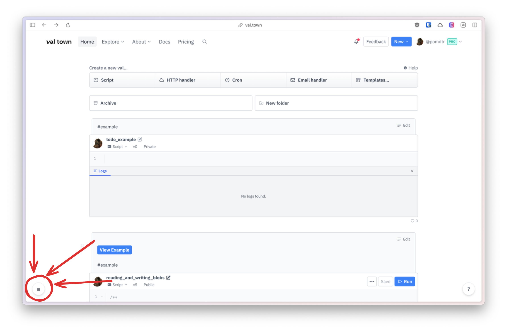
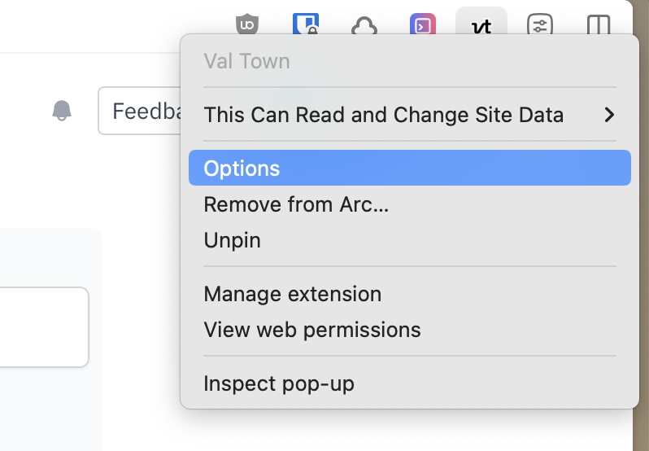
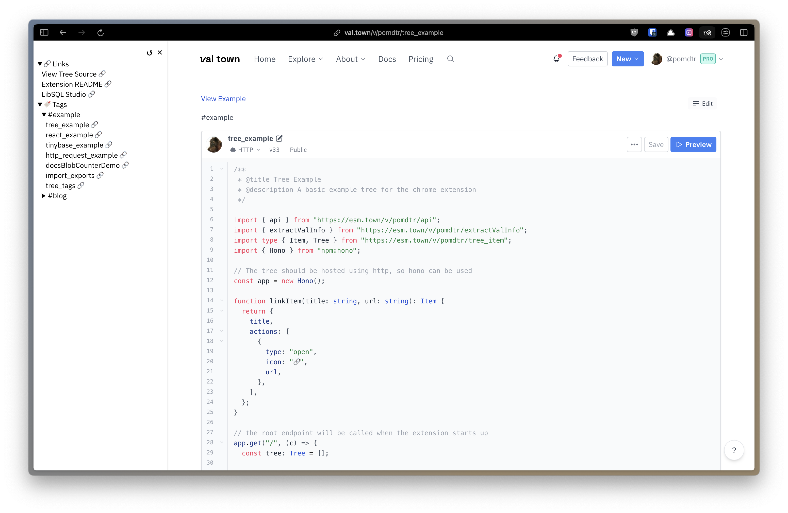

# Chrome Extension for Val Town

Add a customizable sidebar to val.town.

## Installation

1. Download `extension.zip` from the [releases page](https://github.com/pomdtr/val-town-web-extension/releases/latest).
2. Unzip the file.
3. Open the [extensions page](chrome://extensions) in Chrome.
4. Enable developer mode.
5. Click "Load unpacked" and select the unzipped folder.

## Usage

Click on the Sidebar icon on the bottom left of the screen



## Configuration

1. Open the extension options
    

```jsonc
{
    // The url you tree is hosted at
    "root": "https://pomdtr-tree_example.web.val.run",
    // The token to authenticate with (optional, use it if you want to restrict access to your tree)
    "token": "your_token_here"
}
```

## Customization

The val.town extension adds a sidebar to val.town. You can open it by clicking on the icon on the bottom left of the screen.

The content of this sidebar is up to you: Each time the sidebar is opened, the extension will fetch the content from the url specified in the options.

## Example Config



[View Source](https://val-town-by-example.pomdtr.me/v/pomdtr/tree_example)

In order to use the example tree, you can use the following configuration:

```json
{
    "rootUrl": "https://pomdtr-tree_example.web.val.run"
}
```

Or just fork the val, and create your own tree.

## Types

```ts
type Tree = TreeItem[];

type TreeItem = {
  // the title of the tree item
  title: string;
  // Wether the tree item is expanded by default
  expanded?: boolean;
  // The actions that can be performed on the tree item
  actions: Action[];
  // The children of the tree item
  // if a string is provided, the children will be fetched from the tree hosted at the url
  children?: string | TreeItem[];
}

type Action = OpenAction | CopyAction

// An action that copies a string to the clipboard
type CopyAction = {
  icon?: string;
  type: "copy";
  text: string;
}

// An action that opens a url
type OpenAction = {
  icon?: string;
  type: "open";
  url: string;
}
```

## TODO

- [ ] Allow the user to create custom actions
- [ ] Show the sidebar on other websites ?
