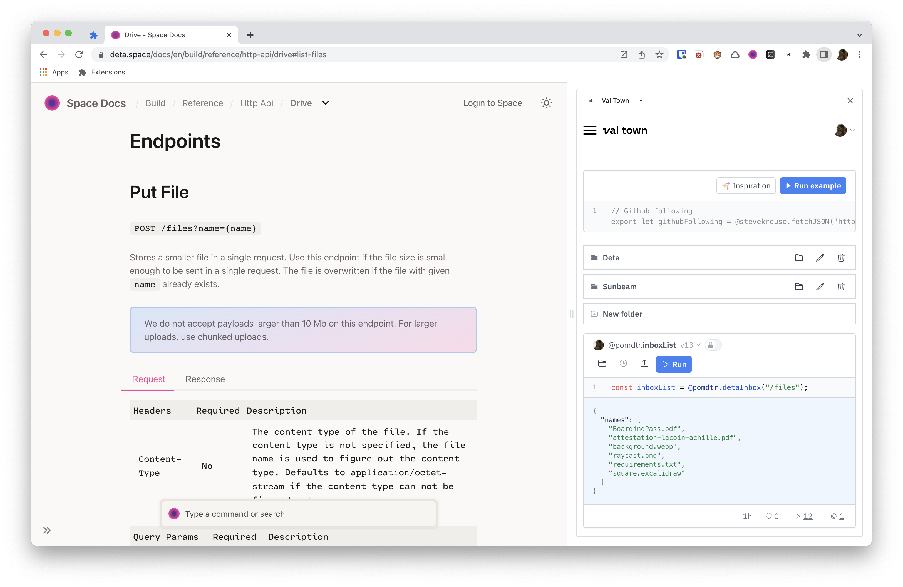
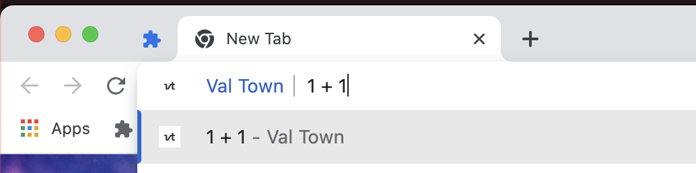
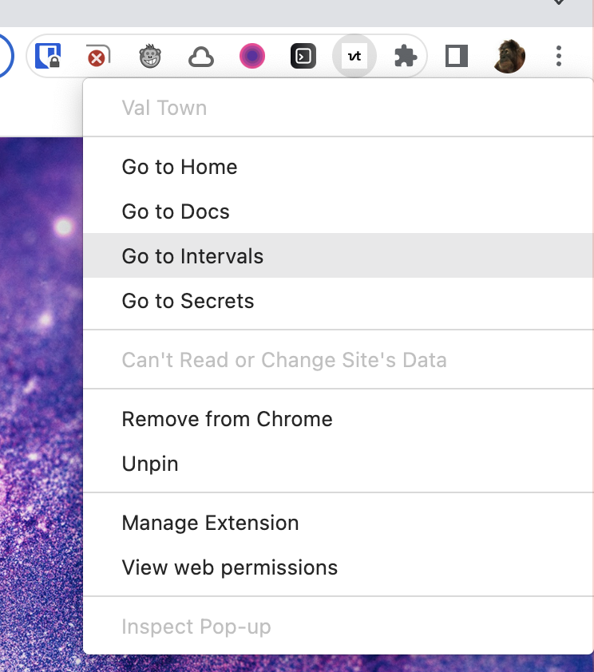

# Web Extension for Val Town

## Features

### Side Panel

Click on the extension icon to open val town in your browser side panel

### Omnibox

Type eval in the omnibox, then write down you expression. Hit enter to run it and display the output in a new tab.

### Context Menu

Right click on the extension icon to show a list of shortcut.

## Installation

1. Download `extension.zip` from the [releases page](https://github.com/deta/web-extension/releases/latest).
2. Extract the zip file.
3. Go to your browser's extensions page (<chrome://extensions> or <edge://extensions>).o
4. Enable developer mode.
5. Click on "Load unpacked" and select the extracted `extension/` folder.
