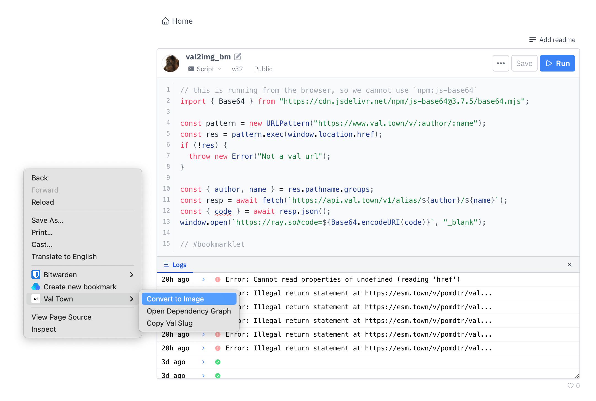

# Chrome Extension for Val Town

Run vals from the browser context menu.



## Usage

Create a new val in val.town containing client-side javascript.

```js
await navigator.clipboard.writeText(`[${document.title}](${location.href})`);
```

Then, click on the extension icon to open the options, and add your item to the `contextMenus` list.

```json
{
    "contextMenus": [
        {
        "title": "Copy Markdown Link",
        "val": "@pomdtr/copy_markdown_link",
        }
    ]
}
```

The following properties are available:

- `title`: The title of the context menu item.
- `val`: The full name of the val to run (`@owner/val_name`).
- `patterns`: An array of URL patterns to match against the current page. If the current page does not match any of the patterns, the context menu item will not be shown. If omitted, the context menu item will be shown on all pages.
- `children`: An array of child context menu items. Cannot be used with `val`.
