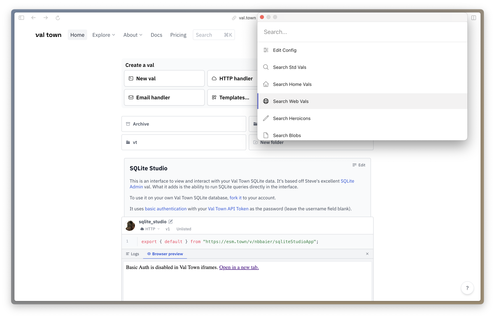

# Chrome Extension for Val Town

Run vals from a command palette.



## Installation

1. Download the latest release from the [releases page](https://github.com/pomdtr/val-town-web-extension/releases/latest).
2. Unzip the file.
3. Open the [extensions page](chrome://extensions) in Chrome.
4. Enable developer mode.
5. Click "Load unpacked" and select the unzipped folder.

## Configuration

1. Open the extension options
    
2. Add you val.town token, and the slug of a val containing the configuration you want to use (you can use <https://val.town/v/pomdtr/extension_config> as a starting point).

```jsonc
{
    "token": "<your token>",
    "root": "pomdtr/extension_config",
}
```

## Usage

Use <kbd>Ctrl</kbd>+<kbd>Shift</kbd>+<kbd>P</kbd> (or <kbd>Cmd</kbd>+<kbd>Shift</kbd>+<kbd>P</kbd> on Mac) to open the command palette.

A list of items will be shown. One or more commands will be available for each item. Use <kbd>Enter</kbd> to run the primary command, or <kbd>Tab</kbd> to cycle through the available commands.

## Development

The extension api is still beeing worked own.

All of the vals referenced in the default config are public, feel free to use them as a starting point.

